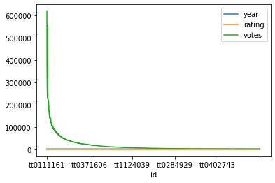
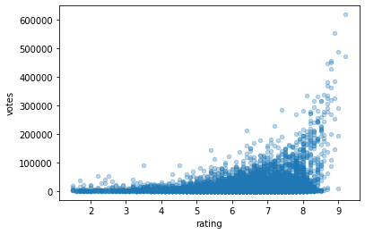
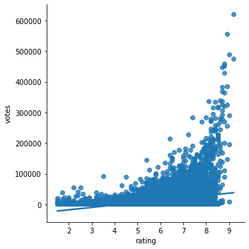
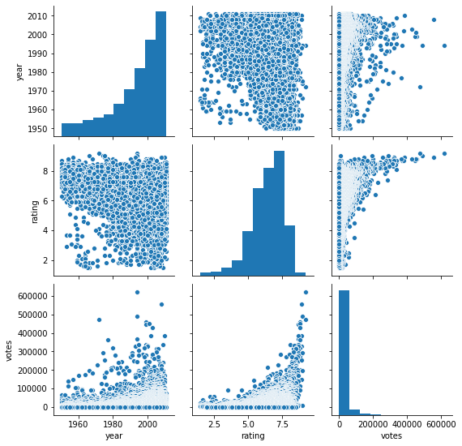
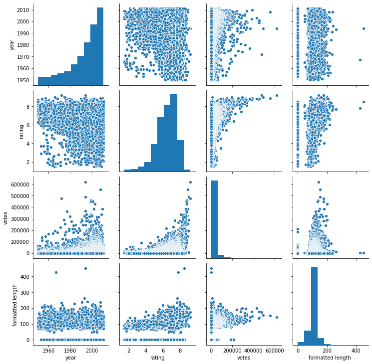

# Import Pandas


```python
import pandas as pd
```

# Importing Data


```python
names = ['id', 'title', 'year', 'rating', 'votes', 'length', 'genres']
data = pd.read_csv('imdb_top_10000.txt', sep="\t", names=names, index_col=0, engine='python')
```

# Exploring our Data


```python
data.head()
```


<div>
<style scoped>
    .dataframe tbody tr th:only-of-type {
        vertical-align: middle;
    }

    .dataframe tbody tr th {
        vertical-align: top;
    }

    .dataframe thead th {
        text-align: right;
    }
</style>
<table border="1" class="dataframe">
  <thead>
    <tr style="text-align: right;">
      <th></th>
      <th>title</th>
      <th>year</th>
      <th>rating</th>
      <th>votes</th>
      <th>length</th>
      <th>genres</th>
    </tr>
    <tr>
      <th>id</th>
      <th></th>
      <th></th>
      <th></th>
      <th></th>
      <th></th>
      <th></th>
    </tr>
  </thead>
  <tbody>
    <tr>
      <th>tt0111161</th>
      <td>The Shawshank Redemption (1994)</td>
      <td>1994</td>
      <td>9.2</td>
      <td>619479</td>
      <td>142 mins.</td>
      <td>Crime|Drama</td>
    </tr>
    <tr>
      <th>tt0110912</th>
      <td>Pulp Fiction (1994)</td>
      <td>1994</td>
      <td>9.0</td>
      <td>490065</td>
      <td>154 mins.</td>
      <td>Crime|Thriller</td>
    </tr>
    <tr>
      <th>tt0137523</th>
      <td>Fight Club (1999)</td>
      <td>1999</td>
      <td>8.8</td>
      <td>458173</td>
      <td>139 mins.</td>
      <td>Drama|Mystery|Thriller</td>
    </tr>
    <tr>
      <th>tt0133093</th>
      <td>The Matrix (1999)</td>
      <td>1999</td>
      <td>8.7</td>
      <td>448114</td>
      <td>136 mins.</td>
      <td>Action|Adventure|Sci-Fi</td>
    </tr>
    <tr>
      <th>tt1375666</th>
      <td>Inception (2010)</td>
      <td>2010</td>
      <td>8.9</td>
      <td>385149</td>
      <td>148 mins.</td>
      <td>Action|Adventure|Sci-Fi|Thriller</td>
    </tr>
  </tbody>
</table>
</div>


```python
data.head(3)
```


<div>
<style scoped>
    .dataframe tbody tr th:only-of-type {
        vertical-align: middle;
    }

    .dataframe tbody tr th {
        vertical-align: top;
    }

    .dataframe thead th {
        text-align: right;
    }
</style>
<table border="1" class="dataframe">
  <thead>
    <tr style="text-align: right;">
      <th></th>
      <th>title</th>
      <th>year</th>
      <th>rating</th>
      <th>votes</th>
      <th>length</th>
      <th>genres</th>
    </tr>
    <tr>
      <th>id</th>
      <th></th>
      <th></th>
      <th></th>
      <th></th>
      <th></th>
      <th></th>
    </tr>
  </thead>
  <tbody>
    <tr>
      <th>tt0111161</th>
      <td>The Shawshank Redemption (1994)</td>
      <td>1994</td>
      <td>9.2</td>
      <td>619479</td>
      <td>142 mins.</td>
      <td>Crime|Drama</td>
    </tr>
    <tr>
      <th>tt0110912</th>
      <td>Pulp Fiction (1994)</td>
      <td>1994</td>
      <td>9.0</td>
      <td>490065</td>
      <td>154 mins.</td>
      <td>Crime|Thriller</td>
    </tr>
    <tr>
      <th>tt0137523</th>
      <td>Fight Club (1999)</td>
      <td>1999</td>
      <td>8.8</td>
      <td>458173</td>
      <td>139 mins.</td>
      <td>Drama|Mystery|Thriller</td>
    </tr>
  </tbody>
</table>
</div>


```python
data.tail()
```


<div>
<style scoped>
    .dataframe tbody tr th:only-of-type {
        vertical-align: middle;
    }

    .dataframe tbody tr th {
        vertical-align: top;
    }

    .dataframe thead th {
        text-align: right;
    }
</style>
<table border="1" class="dataframe">
  <thead>
    <tr style="text-align: right;">
      <th></th>
      <th>title</th>
      <th>year</th>
      <th>rating</th>
      <th>votes</th>
      <th>length</th>
      <th>genres</th>
    </tr>
    <tr>
      <th>id</th>
      <th></th>
      <th></th>
      <th></th>
      <th></th>
      <th></th>
      <th></th>
    </tr>
  </thead>
  <tbody>
    <tr>
      <th>tt0807721</th>
      <td>Meduzot (2007)</td>
      <td>2007</td>
      <td>7.0</td>
      <td>1357</td>
      <td>78 mins.</td>
      <td>Drama</td>
    </tr>
    <tr>
      <th>tt0339642</th>
      <td>Daltry Calhoun (2005)</td>
      <td>2005</td>
      <td>5.2</td>
      <td>1357</td>
      <td>100 mins.</td>
      <td>Comedy|Drama|Music|Romance</td>
    </tr>
    <tr>
      <th>tt0060880</th>
      <td>The Quiller Memorandum (1966)</td>
      <td>1966</td>
      <td>6.5</td>
      <td>1356</td>
      <td>104 mins.</td>
      <td>Drama|Mystery|Thriller</td>
    </tr>
    <tr>
      <th>tt0152836</th>
      <td>Taal (1999)</td>
      <td>1999</td>
      <td>6.5</td>
      <td>1356</td>
      <td>179 mins.</td>
      <td>Musical|Romance</td>
    </tr>
    <tr>
      <th>tt0279977</th>
      <td>The Navigators (2001)</td>
      <td>2001</td>
      <td>6.9</td>
      <td>1356</td>
      <td>96 mins.</td>
      <td>Comedy|Drama</td>
    </tr>
  </tbody>
</table>
</div>


```python
data.info()
```

    <class 'pandas.core.frame.DataFrame'>
    Index: 10000 entries, tt0111161 to tt0279977
    Data columns (total 6 columns):
     #   Column  Non-Null Count  Dtype  
    ---  ------  --------------  -----  
     0   title   10000 non-null  object 
     1   year    10000 non-null  int64  
     2   rating  10000 non-null  float64
     3   votes   10000 non-null  int64  
     4   length  10000 non-null  object 
     5   genres  9999 non-null   object 
    dtypes: float64(1), int64(2), object(3)
    memory usage: 546.9+ KB


```python
data.describe()
```


<div>
<style scoped>
    .dataframe tbody tr th:only-of-type {
        vertical-align: middle;
    }

    .dataframe tbody tr th {
        vertical-align: top;
    }

    .dataframe thead th {
        text-align: right;
    }
</style>
<table border="1" class="dataframe">
  <thead>
    <tr style="text-align: right;">
      <th></th>
      <th>year</th>
      <th>rating</th>
      <th>votes</th>
    </tr>
  </thead>
  <tbody>
    <tr>
      <th>count</th>
      <td>10000.000000</td>
      <td>10000.000000</td>
      <td>10000.000000</td>
    </tr>
    <tr>
      <th>mean</th>
      <td>1993.472800</td>
      <td>6.386070</td>
      <td>16604.012800</td>
    </tr>
    <tr>
      <th>std</th>
      <td>14.829924</td>
      <td>1.189933</td>
      <td>34563.459698</td>
    </tr>
    <tr>
      <th>min</th>
      <td>1950.000000</td>
      <td>1.500000</td>
      <td>1356.000000</td>
    </tr>
    <tr>
      <th>25%</th>
      <td>1986.000000</td>
      <td>5.700000</td>
      <td>2333.750000</td>
    </tr>
    <tr>
      <th>50%</th>
      <td>1998.000000</td>
      <td>6.600000</td>
      <td>4980.500000</td>
    </tr>
    <tr>
      <th>75%</th>
      <td>2005.000000</td>
      <td>7.200000</td>
      <td>15277.750000</td>
    </tr>
    <tr>
      <th>max</th>
      <td>2011.000000</td>
      <td>9.200000</td>
      <td>619479.000000</td>
    </tr>
  </tbody>
</table>
</div>


# Exporting Data


```python
data.to_csv('test.csv', header=True, index=True, sep=',')
```

# Sorting Data


```python
data.sort_values(by='rating')
```


<div>
<style scoped>
    .dataframe tbody tr th:only-of-type {
        vertical-align: middle;
    }

    .dataframe tbody tr th {
        vertical-align: top;
    }

    .dataframe thead th {
        text-align: right;
    }
</style>
<table border="1" class="dataframe">
  <thead>
    <tr style="text-align: right;">
      <th></th>
      <th>title</th>
      <th>year</th>
      <th>rating</th>
      <th>votes</th>
      <th>length</th>
      <th>genres</th>
    </tr>
    <tr>
      <th>id</th>
      <th></th>
      <th></th>
      <th></th>
      <th></th>
      <th></th>
      <th></th>
    </tr>
  </thead>
  <tbody>
    <tr>
      <th>tt0270846</th>
      <td>Superbabies: Baby Geniuses 2 (2004)</td>
      <td>2004</td>
      <td>1.5</td>
      <td>13196</td>
      <td>88 mins.</td>
      <td>Comedy|Family</td>
    </tr>
    <tr>
      <th>tt0059464</th>
      <td>Monster a-Go Go (1965)</td>
      <td>1965</td>
      <td>1.5</td>
      <td>3255</td>
      <td>70 mins.</td>
      <td>Sci-Fi|Horror</td>
    </tr>
    <tr>
      <th>tt0364986</th>
      <td>Ben &amp; Arthur (2002)</td>
      <td>2002</td>
      <td>1.5</td>
      <td>4675</td>
      <td>85 mins.</td>
      <td>Drama|Romance</td>
    </tr>
    <tr>
      <th>tt0421051</th>
      <td>Daniel the Wizard (2004)</td>
      <td>2004</td>
      <td>1.5</td>
      <td>8271</td>
      <td>81 mins.</td>
      <td>Comedy|Crime|Family|Fantasy|Horror</td>
    </tr>
    <tr>
      <th>tt1309000</th>
      <td>Dream Well (2009)</td>
      <td>2009</td>
      <td>1.5</td>
      <td>2848</td>
      <td>00 mins.</td>
      <td>Comedy|Romance|Sport</td>
    </tr>
    <tr>
      <th>...</th>
      <td>...</td>
      <td>...</td>
      <td>...</td>
      <td>...</td>
      <td>...</td>
      <td>...</td>
    </tr>
    <tr>
      <th>tt0071562</th>
      <td>The Godfather: Part II (1974)</td>
      <td>1974</td>
      <td>9.0</td>
      <td>291169</td>
      <td>200 mins.</td>
      <td>Crime|Drama</td>
    </tr>
    <tr>
      <th>tt0060196</th>
      <td>The Good, the Bad and the Ugly (1966)</td>
      <td>1966</td>
      <td>9.0</td>
      <td>195238</td>
      <td>161 mins.</td>
      <td>Western</td>
    </tr>
    <tr>
      <th>tt0110912</th>
      <td>Pulp Fiction (1994)</td>
      <td>1994</td>
      <td>9.0</td>
      <td>490065</td>
      <td>154 mins.</td>
      <td>Crime|Thriller</td>
    </tr>
    <tr>
      <th>tt0068646</th>
      <td>The Godfather (1972)</td>
      <td>1972</td>
      <td>9.2</td>
      <td>474189</td>
      <td>175 mins.</td>
      <td>Crime|Drama</td>
    </tr>
    <tr>
      <th>tt0111161</th>
      <td>The Shawshank Redemption (1994)</td>
      <td>1994</td>
      <td>9.2</td>
      <td>619479</td>
      <td>142 mins.</td>
      <td>Crime|Drama</td>
    </tr>
  </tbody>
</table>
<p>10000 rows × 6 columns</p>
</div>


```python
data.sort_values(by='rating', ascending=False)
```


<div>
<style scoped>
    .dataframe tbody tr th:only-of-type {
        vertical-align: middle;
    }

    .dataframe tbody tr th {
        vertical-align: top;
    }

    .dataframe thead th {
        text-align: right;
    }
</style>
<table border="1" class="dataframe">
  <thead>
    <tr style="text-align: right;">
      <th></th>
      <th>title</th>
      <th>year</th>
      <th>rating</th>
      <th>votes</th>
      <th>length</th>
      <th>genres</th>
    </tr>
    <tr>
      <th>id</th>
      <th></th>
      <th></th>
      <th></th>
      <th></th>
      <th></th>
      <th></th>
    </tr>
  </thead>
  <tbody>
    <tr>
      <th>tt0111161</th>
      <td>The Shawshank Redemption (1994)</td>
      <td>1994</td>
      <td>9.2</td>
      <td>619479</td>
      <td>142 mins.</td>
      <td>Crime|Drama</td>
    </tr>
    <tr>
      <th>tt0068646</th>
      <td>The Godfather (1972)</td>
      <td>1972</td>
      <td>9.2</td>
      <td>474189</td>
      <td>175 mins.</td>
      <td>Crime|Drama</td>
    </tr>
    <tr>
      <th>tt0060196</th>
      <td>The Good, the Bad and the Ugly (1966)</td>
      <td>1966</td>
      <td>9.0</td>
      <td>195238</td>
      <td>161 mins.</td>
      <td>Western</td>
    </tr>
    <tr>
      <th>tt0110912</th>
      <td>Pulp Fiction (1994)</td>
      <td>1994</td>
      <td>9.0</td>
      <td>490065</td>
      <td>154 mins.</td>
      <td>Crime|Thriller</td>
    </tr>
    <tr>
      <th>tt0252487</th>
      <td>Outrageous Class (1975)</td>
      <td>1975</td>
      <td>9.0</td>
      <td>9823</td>
      <td>87 mins.</td>
      <td>Comedy|Drama</td>
    </tr>
    <tr>
      <th>...</th>
      <td>...</td>
      <td>...</td>
      <td>...</td>
      <td>...</td>
      <td>...</td>
      <td>...</td>
    </tr>
    <tr>
      <th>tt0364986</th>
      <td>Ben &amp; Arthur (2002)</td>
      <td>2002</td>
      <td>1.5</td>
      <td>4675</td>
      <td>85 mins.</td>
      <td>Drama|Romance</td>
    </tr>
    <tr>
      <th>tt0060753</th>
      <td>Night Train to Mundo Fine (1966)</td>
      <td>1966</td>
      <td>1.5</td>
      <td>3542</td>
      <td>89 mins.</td>
      <td>Action|Adventure|Crime|War</td>
    </tr>
    <tr>
      <th>tt0421051</th>
      <td>Daniel the Wizard (2004)</td>
      <td>2004</td>
      <td>1.5</td>
      <td>8271</td>
      <td>81 mins.</td>
      <td>Comedy|Crime|Family|Fantasy|Horror</td>
    </tr>
    <tr>
      <th>tt0059464</th>
      <td>Monster a-Go Go (1965)</td>
      <td>1965</td>
      <td>1.5</td>
      <td>3255</td>
      <td>70 mins.</td>
      <td>Sci-Fi|Horror</td>
    </tr>
    <tr>
      <th>tt0060666</th>
      <td>Manos: The Hands of Fate (1966)</td>
      <td>1966</td>
      <td>1.5</td>
      <td>20927</td>
      <td>74 mins.</td>
      <td>Horror</td>
    </tr>
  </tbody>
</table>
<p>10000 rows × 6 columns</p>
</div>


# Creating Data Frames from Scratch


```python
sample_data = {
    'tv' : [230, 44, 17],
    'radio' : [37, 39, 45],
    'news' : [69, 45, 69],
    'sales' : [22, 10, 9]
}
```


```python
data2 = pd.DataFrame(sample_data)
```


```python
data2
```


<div>
<style scoped>
    .dataframe tbody tr th:only-of-type {
        vertical-align: middle;
    }

    .dataframe tbody tr th {
        vertical-align: top;
    }

    .dataframe thead th {
        text-align: right;
    }
</style>
<table border="1" class="dataframe">
  <thead>
    <tr style="text-align: right;">
      <th></th>
      <th>tv</th>
      <th>radio</th>
      <th>news</th>
      <th>sales</th>
    </tr>
  </thead>
  <tbody>
    <tr>
      <th>0</th>
      <td>230</td>
      <td>37</td>
      <td>69</td>
      <td>22</td>
    </tr>
    <tr>
      <th>1</th>
      <td>44</td>
      <td>39</td>
      <td>45</td>
      <td>10</td>
    </tr>
    <tr>
      <th>2</th>
      <td>17</td>
      <td>45</td>
      <td>69</td>
      <td>9</td>
    </tr>
  </tbody>
</table>
</div>


To delete a dataframe: 'del data2'

# Selecting Data


```python
data['title']
```


    id
    tt0111161    The Shawshank Redemption (1994)
    tt0110912                Pulp Fiction (1994)
    tt0137523                  Fight Club (1999)
    tt0133093                  The Matrix (1999)
    tt1375666                   Inception (2010)
                              ...               
    tt0807721                     Meduzot (2007)
    tt0339642              Daltry Calhoun (2005)
    tt0060880      The Quiller Memorandum (1966)
    tt0152836                        Taal (1999)
    tt0279977              The Navigators (2001)
    Name: title, Length: 10000, dtype: object


```python
data[['title', 'year']]
```


<div>
<style scoped>
    .dataframe tbody tr th:only-of-type {
        vertical-align: middle;
    }

    .dataframe tbody tr th {
        vertical-align: top;
    }

    .dataframe thead th {
        text-align: right;
    }
</style>
<table border="1" class="dataframe">
  <thead>
    <tr style="text-align: right;">
      <th></th>
      <th>title</th>
      <th>year</th>
    </tr>
    <tr>
      <th>id</th>
      <th></th>
      <th></th>
    </tr>
  </thead>
  <tbody>
    <tr>
      <th>tt0111161</th>
      <td>The Shawshank Redemption (1994)</td>
      <td>1994</td>
    </tr>
    <tr>
      <th>tt0110912</th>
      <td>Pulp Fiction (1994)</td>
      <td>1994</td>
    </tr>
    <tr>
      <th>tt0137523</th>
      <td>Fight Club (1999)</td>
      <td>1999</td>
    </tr>
    <tr>
      <th>tt0133093</th>
      <td>The Matrix (1999)</td>
      <td>1999</td>
    </tr>
    <tr>
      <th>tt1375666</th>
      <td>Inception (2010)</td>
      <td>2010</td>
    </tr>
    <tr>
      <th>...</th>
      <td>...</td>
      <td>...</td>
    </tr>
    <tr>
      <th>tt0807721</th>
      <td>Meduzot (2007)</td>
      <td>2007</td>
    </tr>
    <tr>
      <th>tt0339642</th>
      <td>Daltry Calhoun (2005)</td>
      <td>2005</td>
    </tr>
    <tr>
      <th>tt0060880</th>
      <td>The Quiller Memorandum (1966)</td>
      <td>1966</td>
    </tr>
    <tr>
      <th>tt0152836</th>
      <td>Taal (1999)</td>
      <td>1999</td>
    </tr>
    <tr>
      <th>tt0279977</th>
      <td>The Navigators (2001)</td>
      <td>2001</td>
    </tr>
  </tbody>
</table>
<p>10000 rows × 2 columns</p>
</div>


```python
data['rating'].mean()
```


    6.386069999999981


```python
data['rating'].max()
```


    9.2


```python
data['rating'].min()
```


    1.5


```python
data['genres'].unique()
```


    array(['Crime|Drama', 'Crime|Thriller', 'Drama|Mystery|Thriller', ...,
           'Drama|War|Adventure|Romance', 'Western|Sci-Fi|Thriller',
           'Adventure|Comedy|Drama|War'], dtype=object)


```python
data['rating'].value_counts()
```


    6.8    401
    7.1    401
    7.2    386
    6.7    384
    7.0    382
          ... 
    1.5      7
    1.6      6
    8.9      5
    9.0      4
    9.2      2
    Name: rating, Length: 77, dtype: int64


```python
data['rating'].value_counts().sort_index()
```


    1.5     7
    1.6     6
    1.7    12
    1.8    12
    1.9     9
           ..
    8.7    13
    8.8     9
    8.9     5
    9.0     4
    9.2     2
    Name: rating, Length: 77, dtype: int64


```python
data['rating'].value_counts().sort_index(ascending=False)
```


    9.2     2
    9.0     4
    8.9     5
    8.8     9
    8.7    13
           ..
    1.9     9
    1.8    12
    1.7    12
    1.6     6
    1.5     7
    Name: rating, Length: 77, dtype: int64


# Plotting


```python
%matplotlib inline
```


```python
data.plot()
```


    <matplotlib.axes._subplots.AxesSubplot at 0x123f60210>





```python
data.plot(kind='scatter', x='rating', y='votes', alpha=0.3)
```


    <matplotlib.axes._subplots.AxesSubplot at 0x1247b0350>





```python
import seaborn as sns
```


```python
sns.lmplot(x='rating', y='votes', data=data)
```


    <seaborn.axisgrid.FacetGrid at 0x124948ed0>





```python
sns.pairplot(data)
```


    <seaborn.axisgrid.PairGrid at 0x1a270c1850>





# Ordinary Least Squares (OLS) Regression


```python
import statsmodels.api as sm
```


```python
results = sm.OLS(data['votes'], data['rating']).fit()
```


```python
results.summary()
```


<table class="simpletable">
<caption>OLS Regression Results</caption>
<tr>
  <th>Dep. Variable:</th>          <td>votes</td>      <th>  R-squared (uncentered):</th>       <td>   0.221</td>  
</tr>
<tr>
  <th>Model:</th>                   <td>OLS</td>       <th>  Adj. R-squared (uncentered):</th>  <td>   0.220</td>  
</tr>
<tr>
  <th>Method:</th>             <td>Least Squares</td>  <th>  F-statistic:       </th>           <td>   2829.</td>  
</tr>
<tr>
  <th>Date:</th>             <td>Sun, 12 Jul 2020</td> <th>  Prob (F-statistic):</th>            <td>  0.00</td>   
</tr>
<tr>
  <th>Time:</th>                 <td>14:04:25</td>     <th>  Log-Likelihood:    </th>          <td>-1.1849e+05</td>
</tr>
<tr>
  <th>No. Observations:</th>      <td> 10000</td>      <th>  AIC:               </th>           <td>2.370e+05</td> 
</tr>
<tr>
  <th>Df Residuals:</th>          <td>  9999</td>      <th>  BIC:               </th>           <td>2.370e+05</td> 
</tr>
<tr>
  <th>Df Model:</th>              <td>     1</td>      <th>                     </th>               <td> </td>     
</tr>
<tr>
  <th>Covariance Type:</th>      <td>nonrobust</td>    <th>                     </th>               <td> </td>     
</tr>
</table>
<table class="simpletable">
<tr>
     <td></td>       <th>coef</th>     <th>std err</th>      <th>t</th>      <th>P>|t|</th>  <th>[0.025</th>    <th>0.975]</th>  
</tr>
<tr>
  <th>rating</th> <td> 2771.9868</td> <td>   52.115</td> <td>   53.190</td> <td> 0.000</td> <td> 2669.831</td> <td> 2874.143</td>
</tr>
</table>
<table class="simpletable">
<tr>
  <th>Omnibus:</th>       <td>11448.927</td> <th>  Durbin-Watson:     </th>  <td>   0.030</td>  
</tr>
<tr>
  <th>Prob(Omnibus):</th>  <td> 0.000</td>   <th>  Jarque-Bera (JB):  </th> <td>1297144.076</td>
</tr>
<tr>
  <th>Skew:</th>           <td> 5.966</td>   <th>  Prob(JB):          </th>  <td>    0.00</td>  
</tr>
<tr>
  <th>Kurtosis:</th>       <td>57.505</td>   <th>  Cond. No.          </th>  <td>    1.00</td>  
</tr>
</table><br/><br/>Warnings:<br/>[1] Standard Errors assume that the covariance matrix of the errors is correctly specified.


# Advanced Data Selection


```python
data[data['year'] > 1995]
```


<div>
<style scoped>
    .dataframe tbody tr th:only-of-type {
        vertical-align: middle;
    }

    .dataframe tbody tr th {
        vertical-align: top;
    }

    .dataframe thead th {
        text-align: right;
    }
</style>
<table border="1" class="dataframe">
  <thead>
    <tr style="text-align: right;">
      <th></th>
      <th>title</th>
      <th>year</th>
      <th>rating</th>
      <th>votes</th>
      <th>length</th>
      <th>genres</th>
    </tr>
    <tr>
      <th>id</th>
      <th></th>
      <th></th>
      <th></th>
      <th></th>
      <th></th>
      <th></th>
    </tr>
  </thead>
  <tbody>
    <tr>
      <th>tt0137523</th>
      <td>Fight Club (1999)</td>
      <td>1999</td>
      <td>8.8</td>
      <td>458173</td>
      <td>139 mins.</td>
      <td>Drama|Mystery|Thriller</td>
    </tr>
    <tr>
      <th>tt0133093</th>
      <td>The Matrix (1999)</td>
      <td>1999</td>
      <td>8.7</td>
      <td>448114</td>
      <td>136 mins.</td>
      <td>Action|Adventure|Sci-Fi</td>
    </tr>
    <tr>
      <th>tt1375666</th>
      <td>Inception (2010)</td>
      <td>2010</td>
      <td>8.9</td>
      <td>385149</td>
      <td>148 mins.</td>
      <td>Action|Adventure|Sci-Fi|Thriller</td>
    </tr>
    <tr>
      <th>tt0169547</th>
      <td>American Beauty (1999)</td>
      <td>1999</td>
      <td>8.6</td>
      <td>338332</td>
      <td>122 mins.</td>
      <td>Drama</td>
    </tr>
    <tr>
      <th>tt0499549</th>
      <td>Avatar (2009)</td>
      <td>2009</td>
      <td>8.1</td>
      <td>336855</td>
      <td>162 mins.</td>
      <td>Action|Adventure|Fantasy|Sci-Fi</td>
    </tr>
    <tr>
      <th>...</th>
      <td>...</td>
      <td>...</td>
      <td>...</td>
      <td>...</td>
      <td>...</td>
      <td>...</td>
    </tr>
    <tr>
      <th>tt0118635</th>
      <td>Aprile (1998)</td>
      <td>1998</td>
      <td>6.7</td>
      <td>1358</td>
      <td>78 mins.</td>
      <td>Comedy</td>
    </tr>
    <tr>
      <th>tt0807721</th>
      <td>Meduzot (2007)</td>
      <td>2007</td>
      <td>7.0</td>
      <td>1357</td>
      <td>78 mins.</td>
      <td>Drama</td>
    </tr>
    <tr>
      <th>tt0339642</th>
      <td>Daltry Calhoun (2005)</td>
      <td>2005</td>
      <td>5.2</td>
      <td>1357</td>
      <td>100 mins.</td>
      <td>Comedy|Drama|Music|Romance</td>
    </tr>
    <tr>
      <th>tt0152836</th>
      <td>Taal (1999)</td>
      <td>1999</td>
      <td>6.5</td>
      <td>1356</td>
      <td>179 mins.</td>
      <td>Musical|Romance</td>
    </tr>
    <tr>
      <th>tt0279977</th>
      <td>The Navigators (2001)</td>
      <td>2001</td>
      <td>6.9</td>
      <td>1356</td>
      <td>96 mins.</td>
      <td>Comedy|Drama</td>
    </tr>
  </tbody>
</table>
<p>5710 rows × 6 columns</p>
</div>


```python
data[data['year'] == 1966]
```


<div>
<style scoped>
    .dataframe tbody tr th:only-of-type {
        vertical-align: middle;
    }

    .dataframe tbody tr th {
        vertical-align: top;
    }

    .dataframe thead th {
        text-align: right;
    }
</style>
<table border="1" class="dataframe">
  <thead>
    <tr style="text-align: right;">
      <th></th>
      <th>title</th>
      <th>year</th>
      <th>rating</th>
      <th>votes</th>
      <th>length</th>
      <th>genres</th>
    </tr>
    <tr>
      <th>id</th>
      <th></th>
      <th></th>
      <th></th>
      <th></th>
      <th></th>
      <th></th>
    </tr>
  </thead>
  <tbody>
    <tr>
      <th>tt0060196</th>
      <td>The Good, the Bad and the Ugly (1966)</td>
      <td>1966</td>
      <td>9.0</td>
      <td>195238</td>
      <td>161 mins.</td>
      <td>Western</td>
    </tr>
    <tr>
      <th>tt0061184</th>
      <td>Who's Afraid of Virginia Woolf? (1966)</td>
      <td>1966</td>
      <td>8.2</td>
      <td>23811</td>
      <td>131 mins.</td>
      <td>Drama</td>
    </tr>
    <tr>
      <th>tt0060666</th>
      <td>Manos: The Hands of Fate (1966)</td>
      <td>1966</td>
      <td>1.5</td>
      <td>20927</td>
      <td>74 mins.</td>
      <td>Horror</td>
    </tr>
    <tr>
      <th>tt0060827</th>
      <td>Persona (1966)</td>
      <td>1966</td>
      <td>8.2</td>
      <td>20157</td>
      <td>85 mins.</td>
      <td>Drama|Fantasy</td>
    </tr>
    <tr>
      <th>tt0060176</th>
      <td>Blow-Up (1966)</td>
      <td>1966</td>
      <td>7.6</td>
      <td>18679</td>
      <td>111 mins.</td>
      <td>Drama|Mystery|Thriller</td>
    </tr>
    <tr>
      <th>...</th>
      <td>...</td>
      <td>...</td>
      <td>...</td>
      <td>...</td>
      <td>...</td>
      <td>...</td>
    </tr>
    <tr>
      <th>tt0060214</th>
      <td>Carry on Screaming! (1966)</td>
      <td>1966</td>
      <td>6.7</td>
      <td>1427</td>
      <td>97 mins.</td>
      <td>Comedy|Horror</td>
    </tr>
    <tr>
      <th>tt0060305</th>
      <td>Le Deuxieme Souffle (1966)</td>
      <td>1966</td>
      <td>8.0</td>
      <td>1393</td>
      <td>150 mins.</td>
      <td>Crime|Drama</td>
    </tr>
    <tr>
      <th>tt0060841</th>
      <td>The Plague of the Zombies (1966)</td>
      <td>1966</td>
      <td>6.7</td>
      <td>1386</td>
      <td>91 mins.</td>
      <td>Horror</td>
    </tr>
    <tr>
      <th>tt0061204</th>
      <td>The Wrong Box (1966)</td>
      <td>1966</td>
      <td>6.9</td>
      <td>1372</td>
      <td>105 mins.</td>
      <td>Comedy</td>
    </tr>
    <tr>
      <th>tt0060880</th>
      <td>The Quiller Memorandum (1966)</td>
      <td>1966</td>
      <td>6.5</td>
      <td>1356</td>
      <td>104 mins.</td>
      <td>Drama|Mystery|Thriller</td>
    </tr>
  </tbody>
</table>
<p>69 rows × 6 columns</p>
</div>


```python
data[(data['year']  > 1995) & (data['year'] < 2000)]
```


<div>
<style scoped>
    .dataframe tbody tr th:only-of-type {
        vertical-align: middle;
    }

    .dataframe tbody tr th {
        vertical-align: top;
    }

    .dataframe thead th {
        text-align: right;
    }
</style>
<table border="1" class="dataframe">
  <thead>
    <tr style="text-align: right;">
      <th></th>
      <th>title</th>
      <th>year</th>
      <th>rating</th>
      <th>votes</th>
      <th>length</th>
      <th>genres</th>
    </tr>
    <tr>
      <th>id</th>
      <th></th>
      <th></th>
      <th></th>
      <th></th>
      <th></th>
      <th></th>
    </tr>
  </thead>
  <tbody>
    <tr>
      <th>tt0137523</th>
      <td>Fight Club (1999)</td>
      <td>1999</td>
      <td>8.8</td>
      <td>458173</td>
      <td>139 mins.</td>
      <td>Drama|Mystery|Thriller</td>
    </tr>
    <tr>
      <th>tt0133093</th>
      <td>The Matrix (1999)</td>
      <td>1999</td>
      <td>8.7</td>
      <td>448114</td>
      <td>136 mins.</td>
      <td>Action|Adventure|Sci-Fi</td>
    </tr>
    <tr>
      <th>tt0169547</th>
      <td>American Beauty (1999)</td>
      <td>1999</td>
      <td>8.6</td>
      <td>338332</td>
      <td>122 mins.</td>
      <td>Drama</td>
    </tr>
    <tr>
      <th>tt0120338</th>
      <td>Titanic (1997)</td>
      <td>1997</td>
      <td>7.4</td>
      <td>284245</td>
      <td>194 mins.</td>
      <td>Adventure|Drama|History|Romance</td>
    </tr>
    <tr>
      <th>tt0167404</th>
      <td>The Sixth Sense (1999)</td>
      <td>1999</td>
      <td>8.2</td>
      <td>278210</td>
      <td>107 mins.</td>
      <td>Drama|Mystery|Thriller</td>
    </tr>
    <tr>
      <th>...</th>
      <td>...</td>
      <td>...</td>
      <td>...</td>
      <td>...</td>
      <td>...</td>
      <td>...</td>
    </tr>
    <tr>
      <th>tt0117690</th>
      <td>Some Mother's Son (1996)</td>
      <td>1996</td>
      <td>7.3</td>
      <td>1371</td>
      <td>112 mins.</td>
      <td>Drama</td>
    </tr>
    <tr>
      <th>tt0289424</th>
      <td>The Ring Virus (1999)</td>
      <td>1999</td>
      <td>6.5</td>
      <td>1371</td>
      <td>108 mins.</td>
      <td>Horror</td>
    </tr>
    <tr>
      <th>tt0197094</th>
      <td>What Becomes of the Broken Hearted? (1999)</td>
      <td>1999</td>
      <td>6.3</td>
      <td>1365</td>
      <td>00 mins.</td>
      <td>Drama</td>
    </tr>
    <tr>
      <th>tt0118635</th>
      <td>Aprile (1998)</td>
      <td>1998</td>
      <td>6.7</td>
      <td>1358</td>
      <td>78 mins.</td>
      <td>Comedy</td>
    </tr>
    <tr>
      <th>tt0152836</th>
      <td>Taal (1999)</td>
      <td>1999</td>
      <td>6.5</td>
      <td>1356</td>
      <td>179 mins.</td>
      <td>Musical|Romance</td>
    </tr>
  </tbody>
</table>
<p>1123 rows × 6 columns</p>
</div>


```python
data[(data['year']  > 1995) & (data['year'] < 2000)].sort_values(by='rating', ascending=False).head(10)
```


<div>
<style scoped>
    .dataframe tbody tr th:only-of-type {
        vertical-align: middle;
    }

    .dataframe tbody tr th {
        vertical-align: top;
    }

    .dataframe thead th {
        text-align: right;
    }
</style>
<table border="1" class="dataframe">
  <thead>
    <tr style="text-align: right;">
      <th></th>
      <th>title</th>
      <th>year</th>
      <th>rating</th>
      <th>votes</th>
      <th>length</th>
      <th>genres</th>
    </tr>
    <tr>
      <th>id</th>
      <th></th>
      <th></th>
      <th></th>
      <th></th>
      <th></th>
      <th></th>
    </tr>
  </thead>
  <tbody>
    <tr>
      <th>tt0137523</th>
      <td>Fight Club (1999)</td>
      <td>1999</td>
      <td>8.8</td>
      <td>458173</td>
      <td>139 mins.</td>
      <td>Drama|Mystery|Thriller</td>
    </tr>
    <tr>
      <th>tt0133093</th>
      <td>The Matrix (1999)</td>
      <td>1999</td>
      <td>8.7</td>
      <td>448114</td>
      <td>136 mins.</td>
      <td>Action|Adventure|Sci-Fi</td>
    </tr>
    <tr>
      <th>tt0120586</th>
      <td>American History X (1998)</td>
      <td>1998</td>
      <td>8.6</td>
      <td>270082</td>
      <td>119 mins.</td>
      <td>Crime|Drama</td>
    </tr>
    <tr>
      <th>tt0169547</th>
      <td>American Beauty (1999)</td>
      <td>1999</td>
      <td>8.6</td>
      <td>338332</td>
      <td>122 mins.</td>
      <td>Drama</td>
    </tr>
    <tr>
      <th>tt0118799</th>
      <td>Life Is Beautiful (1997)</td>
      <td>1997</td>
      <td>8.5</td>
      <td>131578</td>
      <td>116 mins.</td>
      <td>Comedy|Drama|Romance|War</td>
    </tr>
    <tr>
      <th>tt0120815</th>
      <td>Saving Private Ryan (1998)</td>
      <td>1998</td>
      <td>8.5</td>
      <td>317912</td>
      <td>169 mins.</td>
      <td>Action|Drama|History|War</td>
    </tr>
    <tr>
      <th>tt0119488</th>
      <td>L.A. Confidential (1997)</td>
      <td>1997</td>
      <td>8.4</td>
      <td>187115</td>
      <td>138 mins.</td>
      <td>Crime|Drama|Mystery|Thriller</td>
    </tr>
    <tr>
      <th>tt0119698</th>
      <td>Princess Mononoke (1997)</td>
      <td>1997</td>
      <td>8.4</td>
      <td>77859</td>
      <td>134 mins.</td>
      <td>Animation|Adventure|Fantasy</td>
    </tr>
    <tr>
      <th>tt0120689</th>
      <td>The Green Mile (1999)</td>
      <td>1999</td>
      <td>8.4</td>
      <td>243660</td>
      <td>189 mins.</td>
      <td>Crime|Drama|Fantasy|Mystery</td>
    </tr>
    <tr>
      <th>tt0128332</th>
      <td>Innocence (1997)</td>
      <td>1997</td>
      <td>8.3</td>
      <td>2402</td>
      <td>110 mins.</td>
      <td>Drama</td>
    </tr>
  </tbody>
</table>
</div>


# Grouping


```python
data.groupby(data['year'])['rating'].mean()
```


    year
    1950    7.545161
    1951    7.478125
    1952    7.475676
    1953    7.106383
    1954    7.371795
              ...   
    2007    6.303831
    2008    6.275260
    2009    6.287290
    2010    6.340635
    2011    6.357143
    Name: rating, Length: 62, dtype: float64


```python
data.groupby(data['year'])['rating'].max()
```


    year
    1950    8.7
    1951    8.3
    1952    8.4
    1953    8.3
    1954    8.8
           ... 
    2007    8.3
    2008    8.9
    2009    8.4
    2010    8.9
    2011    8.6
    Name: rating, Length: 62, dtype: float64


```python
data.groupby(data['year'])['rating'].min()
```


    year
    1950    6.3
    1951    6.2
    1952    6.3
    1953    2.9
    1954    6.1
           ... 
    2007    1.6
    2008    1.7
    2009    1.5
    2010    2.2
    2011    2.1
    Name: rating, Length: 62, dtype: float64


# Challenges

### What was the highest scoring movie in 1996?


```python
data[data['year'] == 1996].sort_values(by='rating', ascending=False).head(2)
```


<div>
<style scoped>
    .dataframe tbody tr th:only-of-type {
        vertical-align: middle;
    }

    .dataframe tbody tr th {
        vertical-align: top;
    }

    .dataframe thead th {
        text-align: right;
    }
</style>
<table border="1" class="dataframe">
  <thead>
    <tr style="text-align: right;">
      <th></th>
      <th>title</th>
      <th>year</th>
      <th>rating</th>
      <th>votes</th>
      <th>length</th>
      <th>genres</th>
    </tr>
    <tr>
      <th>id</th>
      <th></th>
      <th></th>
      <th></th>
      <th></th>
      <th></th>
      <th></th>
    </tr>
  </thead>
  <tbody>
    <tr>
      <th>tt0116282</th>
      <td>Fargo (1996)</td>
      <td>1996</td>
      <td>8.3</td>
      <td>187498</td>
      <td>98 mins.</td>
      <td>Crime|Drama|Thriller</td>
    </tr>
    <tr>
      <th>tt0116231</th>
      <td>The Bandit (1996)</td>
      <td>1996</td>
      <td>8.3</td>
      <td>13288</td>
      <td>121 mins.</td>
      <td>Action|Crime|Drama|Romance|Thriller</td>
    </tr>
  </tbody>
</table>
</div>


### In what year was the highest rated movie of all time made?


```python
data[data['rating'] == data['rating'].max()]
```


<div>
<style scoped>
    .dataframe tbody tr th:only-of-type {
        vertical-align: middle;
    }

    .dataframe tbody tr th {
        vertical-align: top;
    }

    .dataframe thead th {
        text-align: right;
    }
</style>
<table border="1" class="dataframe">
  <thead>
    <tr style="text-align: right;">
      <th></th>
      <th>title</th>
      <th>year</th>
      <th>rating</th>
      <th>votes</th>
      <th>length</th>
      <th>genres</th>
    </tr>
    <tr>
      <th>id</th>
      <th></th>
      <th></th>
      <th></th>
      <th></th>
      <th></th>
      <th></th>
    </tr>
  </thead>
  <tbody>
    <tr>
      <th>tt0111161</th>
      <td>The Shawshank Redemption (1994)</td>
      <td>1994</td>
      <td>9.2</td>
      <td>619479</td>
      <td>142 mins.</td>
      <td>Crime|Drama</td>
    </tr>
    <tr>
      <th>tt0068646</th>
      <td>The Godfather (1972)</td>
      <td>1972</td>
      <td>9.2</td>
      <td>474189</td>
      <td>175 mins.</td>
      <td>Crime|Drama</td>
    </tr>
  </tbody>
</table>
</div>


### What five movies have the most votes ever?


```python
data.sort_values(by='votes', ascending=False).head()
```


<div>
<style scoped>
    .dataframe tbody tr th:only-of-type {
        vertical-align: middle;
    }

    .dataframe tbody tr th {
        vertical-align: top;
    }

    .dataframe thead th {
        text-align: right;
    }
</style>
<table border="1" class="dataframe">
  <thead>
    <tr style="text-align: right;">
      <th></th>
      <th>title</th>
      <th>year</th>
      <th>rating</th>
      <th>votes</th>
      <th>length</th>
      <th>genres</th>
    </tr>
    <tr>
      <th>id</th>
      <th></th>
      <th></th>
      <th></th>
      <th></th>
      <th></th>
      <th></th>
    </tr>
  </thead>
  <tbody>
    <tr>
      <th>tt0111161</th>
      <td>The Shawshank Redemption (1994)</td>
      <td>1994</td>
      <td>9.2</td>
      <td>619479</td>
      <td>142 mins.</td>
      <td>Crime|Drama</td>
    </tr>
    <tr>
      <th>tt0468569</th>
      <td>The Dark Knight (2008)</td>
      <td>2008</td>
      <td>8.9</td>
      <td>555122</td>
      <td>152 mins.</td>
      <td>Action|Crime|Drama|Thriller</td>
    </tr>
    <tr>
      <th>tt0110912</th>
      <td>Pulp Fiction (1994)</td>
      <td>1994</td>
      <td>9.0</td>
      <td>490065</td>
      <td>154 mins.</td>
      <td>Crime|Thriller</td>
    </tr>
    <tr>
      <th>tt0068646</th>
      <td>The Godfather (1972)</td>
      <td>1972</td>
      <td>9.2</td>
      <td>474189</td>
      <td>175 mins.</td>
      <td>Crime|Drama</td>
    </tr>
    <tr>
      <th>tt0137523</th>
      <td>Fight Club (1999)</td>
      <td>1999</td>
      <td>8.8</td>
      <td>458173</td>
      <td>139 mins.</td>
      <td>Drama|Mystery|Thriller</td>
    </tr>
  </tbody>
</table>
</div>


### What year in the 1960s had the highest average movie rating?


```python
data[(data['year'] >= 1960) & (data['year'] < 1970)].groupby(data['year'])['rating'].mean()
```


    year
    1960    7.247917
    1961    7.195349
    1962    7.349057
    1963    7.103922
    1964    6.865217
    1965    6.996875
    1966    6.895652
    1967    7.169091
    1968    6.967213
    1969    7.011321
    Name: rating, dtype: float64


#### The highest average movies rating in the 1960s was 1962

# Cleaning Data


```python
data['title'].str[:-7]
```


    id
    tt0111161    The Shawshank Redemption
    tt0110912                Pulp Fiction
    tt0137523                  Fight Club
    tt0133093                  The Matrix
    tt1375666                   Inception
                           ...           
    tt0807721                     Meduzot
    tt0339642              Daltry Calhoun
    tt0060880      The Quiller Memorandum
    tt0152836                        Taal
    tt0279977              The Navigators
    Name: title, Length: 10000, dtype: object


### Another way to do it:


```python
data['formatted title'] = data['title'].str[:-7]
```


```python
data.head()
```


<div>
<style scoped>
    .dataframe tbody tr th:only-of-type {
        vertical-align: middle;
    }

    .dataframe tbody tr th {
        vertical-align: top;
    }

    .dataframe thead th {
        text-align: right;
    }
</style>
<table border="1" class="dataframe">
  <thead>
    <tr style="text-align: right;">
      <th></th>
      <th>title</th>
      <th>year</th>
      <th>rating</th>
      <th>votes</th>
      <th>length</th>
      <th>genres</th>
      <th>formatted title</th>
    </tr>
    <tr>
      <th>id</th>
      <th></th>
      <th></th>
      <th></th>
      <th></th>
      <th></th>
      <th></th>
      <th></th>
    </tr>
  </thead>
  <tbody>
    <tr>
      <th>tt0111161</th>
      <td>The Shawshank Redemption (1994)</td>
      <td>1994</td>
      <td>9.2</td>
      <td>619479</td>
      <td>142 mins.</td>
      <td>Crime|Drama</td>
      <td>The Shawshank Redemption</td>
    </tr>
    <tr>
      <th>tt0110912</th>
      <td>Pulp Fiction (1994)</td>
      <td>1994</td>
      <td>9.0</td>
      <td>490065</td>
      <td>154 mins.</td>
      <td>Crime|Thriller</td>
      <td>Pulp Fiction</td>
    </tr>
    <tr>
      <th>tt0137523</th>
      <td>Fight Club (1999)</td>
      <td>1999</td>
      <td>8.8</td>
      <td>458173</td>
      <td>139 mins.</td>
      <td>Drama|Mystery|Thriller</td>
      <td>Fight Club</td>
    </tr>
    <tr>
      <th>tt0133093</th>
      <td>The Matrix (1999)</td>
      <td>1999</td>
      <td>8.7</td>
      <td>448114</td>
      <td>136 mins.</td>
      <td>Action|Adventure|Sci-Fi</td>
      <td>The Matrix</td>
    </tr>
    <tr>
      <th>tt1375666</th>
      <td>Inception (2010)</td>
      <td>2010</td>
      <td>8.9</td>
      <td>385149</td>
      <td>148 mins.</td>
      <td>Action|Adventure|Sci-Fi|Thriller</td>
      <td>Inception</td>
    </tr>
  </tbody>
</table>
</div>


### A safer way to accomplish the same result:


```python
data['title'].str.split(' \(')
```


    id
    tt0111161    [The Shawshank Redemption, 1994)]
    tt0110912                [Pulp Fiction, 1994)]
    tt0137523                  [Fight Club, 1999)]
    tt0133093                  [The Matrix, 1999)]
    tt1375666                   [Inception, 2010)]
                               ...                
    tt0807721                     [Meduzot, 2007)]
    tt0339642              [Daltry Calhoun, 2005)]
    tt0060880      [The Quiller Memorandum, 1966)]
    tt0152836                        [Taal, 1999)]
    tt0279977              [The Navigators, 2001)]
    Name: title, Length: 10000, dtype: object


```python
data['title'].str.split(' \(').str[0]
```


    id
    tt0111161    The Shawshank Redemption
    tt0110912                Pulp Fiction
    tt0137523                  Fight Club
    tt0133093                  The Matrix
    tt1375666                   Inception
                           ...           
    tt0807721                     Meduzot
    tt0339642              Daltry Calhoun
    tt0060880      The Quiller Memorandum
    tt0152836                        Taal
    tt0279977              The Navigators
    Name: title, Length: 10000, dtype: object


### You can also get the same information with the following command:


```python
data['title'].str.split(' \(').str[0]
```


    id
    tt0111161    The Shawshank Redemption
    tt0110912                Pulp Fiction
    tt0137523                  Fight Club
    tt0133093                  The Matrix
    tt1375666                   Inception
                           ...           
    tt0807721                     Meduzot
    tt0339642              Daltry Calhoun
    tt0060880      The Quiller Memorandum
    tt0152836                        Taal
    tt0279977              The Navigators
    Name: title, Length: 10000, dtype: object


```python
data.head()
```


<div>
<style scoped>
    .dataframe tbody tr th:only-of-type {
        vertical-align: middle;
    }

    .dataframe tbody tr th {
        vertical-align: top;
    }

    .dataframe thead th {
        text-align: right;
    }
</style>
<table border="1" class="dataframe">
  <thead>
    <tr style="text-align: right;">
      <th></th>
      <th>title</th>
      <th>year</th>
      <th>rating</th>
      <th>votes</th>
      <th>length</th>
      <th>genres</th>
      <th>formatted title</th>
    </tr>
    <tr>
      <th>id</th>
      <th></th>
      <th></th>
      <th></th>
      <th></th>
      <th></th>
      <th></th>
      <th></th>
    </tr>
  </thead>
  <tbody>
    <tr>
      <th>tt0111161</th>
      <td>The Shawshank Redemption (1994)</td>
      <td>1994</td>
      <td>9.2</td>
      <td>619479</td>
      <td>142 mins.</td>
      <td>Crime|Drama</td>
      <td>The Shawshank Redemption</td>
    </tr>
    <tr>
      <th>tt0110912</th>
      <td>Pulp Fiction (1994)</td>
      <td>1994</td>
      <td>9.0</td>
      <td>490065</td>
      <td>154 mins.</td>
      <td>Crime|Thriller</td>
      <td>Pulp Fiction</td>
    </tr>
    <tr>
      <th>tt0137523</th>
      <td>Fight Club (1999)</td>
      <td>1999</td>
      <td>8.8</td>
      <td>458173</td>
      <td>139 mins.</td>
      <td>Drama|Mystery|Thriller</td>
      <td>Fight Club</td>
    </tr>
    <tr>
      <th>tt0133093</th>
      <td>The Matrix (1999)</td>
      <td>1999</td>
      <td>8.7</td>
      <td>448114</td>
      <td>136 mins.</td>
      <td>Action|Adventure|Sci-Fi</td>
      <td>The Matrix</td>
    </tr>
    <tr>
      <th>tt1375666</th>
      <td>Inception (2010)</td>
      <td>2010</td>
      <td>8.9</td>
      <td>385149</td>
      <td>148 mins.</td>
      <td>Action|Adventure|Sci-Fi|Thriller</td>
      <td>Inception</td>
    </tr>
  </tbody>
</table>
</div>


### There is other ways to do the same thing. One way is using 'replaces', by learning regular expressions.

## Squeaky Clean Data: Part 2

### Cleaning up the length column 


```python
data['length'].str[:-6]
```


    id
    tt0111161    142
    tt0110912    154
    tt0137523    139
    tt0133093    136
    tt1375666    148
                ... 
    tt0807721     78
    tt0339642    100
    tt0060880    104
    tt0152836    179
    tt0279977     96
    Name: length, Length: 10000, dtype: object


```python
data['length'].str.split().str.get(0) # SAFER BET
```


    id
    tt0111161    142
    tt0110912    154
    tt0137523    139
    tt0133093    136
    tt1375666    148
                ... 
    tt0807721     78
    tt0339642    100
    tt0060880    104
    tt0152836    179
    tt0279977     96
    Name: length, Length: 10000, dtype: object


```python
data['length'].str.split().str.get(0).astype('int') # Converting it to a integer
```


    id
    tt0111161    142
    tt0110912    154
    tt0137523    139
    tt0133093    136
    tt1375666    148
                ... 
    tt0807721     78
    tt0339642    100
    tt0060880    104
    tt0152836    179
    tt0279977     96
    Name: length, Length: 10000, dtype: int64


### Another Method that can be used:


```python
data[ 'length' ].str.replace(' mins.', ' ').astype('int')
```


    id
    tt0111161    142
    tt0110912    154
    tt0137523    139
    tt0133093    136
    tt1375666    148
                ... 
    tt0807721     78
    tt0339642    100
    tt0060880    104
    tt0152836    179
    tt0279977     96
    Name: length, Length: 10000, dtype: int64


```python
data[ 'formatted length '] = data[ 'length' ].str.replace(' mins.', ' ').astype('int')
```


```python
data.head()
```


<div>
<style scoped>
    .dataframe tbody tr th:only-of-type {
        vertical-align: middle;
    }

    .dataframe tbody tr th {
        vertical-align: top;
    }

    .dataframe thead th {
        text-align: right;
    }
</style>
<table border="1" class="dataframe">
  <thead>
    <tr style="text-align: right;">
      <th></th>
      <th>title</th>
      <th>year</th>
      <th>rating</th>
      <th>votes</th>
      <th>length</th>
      <th>genres</th>
      <th>formatted title</th>
      <th>formatted length</th>
    </tr>
    <tr>
      <th>id</th>
      <th></th>
      <th></th>
      <th></th>
      <th></th>
      <th></th>
      <th></th>
      <th></th>
      <th></th>
    </tr>
  </thead>
  <tbody>
    <tr>
      <th>tt0111161</th>
      <td>The Shawshank Redemption (1994)</td>
      <td>1994</td>
      <td>9.2</td>
      <td>619479</td>
      <td>142 mins.</td>
      <td>Crime|Drama</td>
      <td>The Shawshank Redemption</td>
      <td>142</td>
    </tr>
    <tr>
      <th>tt0110912</th>
      <td>Pulp Fiction (1994)</td>
      <td>1994</td>
      <td>9.0</td>
      <td>490065</td>
      <td>154 mins.</td>
      <td>Crime|Thriller</td>
      <td>Pulp Fiction</td>
      <td>154</td>
    </tr>
    <tr>
      <th>tt0137523</th>
      <td>Fight Club (1999)</td>
      <td>1999</td>
      <td>8.8</td>
      <td>458173</td>
      <td>139 mins.</td>
      <td>Drama|Mystery|Thriller</td>
      <td>Fight Club</td>
      <td>139</td>
    </tr>
    <tr>
      <th>tt0133093</th>
      <td>The Matrix (1999)</td>
      <td>1999</td>
      <td>8.7</td>
      <td>448114</td>
      <td>136 mins.</td>
      <td>Action|Adventure|Sci-Fi</td>
      <td>The Matrix</td>
      <td>136</td>
    </tr>
    <tr>
      <th>tt1375666</th>
      <td>Inception (2010)</td>
      <td>2010</td>
      <td>8.9</td>
      <td>385149</td>
      <td>148 mins.</td>
      <td>Action|Adventure|Sci-Fi|Thriller</td>
      <td>Inception</td>
      <td>148</td>
    </tr>
  </tbody>
</table>
</div>


```python
sns.pairplot(data)
```


    <seaborn.axisgrid.PairGrid at 0x1a2a1bba50>





```python
data[data['formatted length '] == 0]
```


<div>
<style scoped>
    .dataframe tbody tr th:only-of-type {
        vertical-align: middle;
    }

    .dataframe tbody tr th {
        vertical-align: top;
    }

    .dataframe thead th {
        text-align: right;
    }
</style>
<table border="1" class="dataframe">
  <thead>
    <tr style="text-align: right;">
      <th></th>
      <th>title</th>
      <th>year</th>
      <th>rating</th>
      <th>votes</th>
      <th>length</th>
      <th>genres</th>
      <th>formatted title</th>
      <th>formatted length</th>
    </tr>
    <tr>
      <th>id</th>
      <th></th>
      <th></th>
      <th></th>
      <th></th>
      <th></th>
      <th></th>
      <th></th>
      <th></th>
    </tr>
  </thead>
  <tbody>
    <tr>
      <th>tt0457430</th>
      <td>Pan's Labyrinth (2006)</td>
      <td>2006</td>
      <td>8.4</td>
      <td>186080</td>
      <td>00 mins.</td>
      <td>Drama|Fantasy|Mystery</td>
      <td>Pan's Labyrinth</td>
      <td>0</td>
    </tr>
    <tr>
      <th>tt0081505</th>
      <td>The Shining (1980)</td>
      <td>1980</td>
      <td>8.5</td>
      <td>212988</td>
      <td>00 mins.</td>
      <td>Drama|Horror|Mystery</td>
      <td>The Shining</td>
      <td>0</td>
    </tr>
    <tr>
      <th>tt1077258</th>
      <td>Planet Terror (2007)</td>
      <td>2007</td>
      <td>7.5</td>
      <td>74950</td>
      <td>00 mins.</td>
      <td>Action|Horror|Sci-Fi</td>
      <td>Planet Terror</td>
      <td>0</td>
    </tr>
    <tr>
      <th>tt0075860</th>
      <td>Close Encounters of the Third Kind (1977)</td>
      <td>1977</td>
      <td>7.8</td>
      <td>65768</td>
      <td>00 mins.</td>
      <td>Drama|Sci-Fi</td>
      <td>Close Encounters of the Third Kind</td>
      <td>0</td>
    </tr>
    <tr>
      <th>tt0054331</th>
      <td>Spartacus (1960)</td>
      <td>1960</td>
      <td>8.0</td>
      <td>55504</td>
      <td>00 mins.</td>
      <td>Action|Adventure|Biography|Drama|History</td>
      <td>Spartacus</td>
      <td>0</td>
    </tr>
    <tr>
      <th>...</th>
      <td>...</td>
      <td>...</td>
      <td>...</td>
      <td>...</td>
      <td>...</td>
      <td>...</td>
      <td>...</td>
      <td>...</td>
    </tr>
    <tr>
      <th>tt1042499</th>
      <td>Filth and Wisdom (2008)</td>
      <td>2008</td>
      <td>5.1</td>
      <td>1367</td>
      <td>00 mins.</td>
      <td>Comedy|Drama|Music|Romance</td>
      <td>Filth and Wisdom</td>
      <td>0</td>
    </tr>
    <tr>
      <th>tt0094642</th>
      <td>American Gothic (1988)</td>
      <td>1988</td>
      <td>5.1</td>
      <td>1359</td>
      <td>00 mins.</td>
      <td>Horror</td>
      <td>American Gothic</td>
      <td>0</td>
    </tr>
    <tr>
      <th>tt1926313</th>
      <td>Pyaar Ka Punchnama (2011)</td>
      <td>2011</td>
      <td>8.0</td>
      <td>1359</td>
      <td>00 mins.</td>
      <td>Comedy|Drama|Romance</td>
      <td>Pyaar Ka Punchnama</td>
      <td>0</td>
    </tr>
    <tr>
      <th>tt0878674</th>
      <td>Garage (2007)</td>
      <td>2007</td>
      <td>6.9</td>
      <td>1356</td>
      <td>00 mins.</td>
      <td>Drama</td>
      <td>Garage</td>
      <td>0</td>
    </tr>
    <tr>
      <th>tt0197094</th>
      <td>What Becomes of the Broken Hearted? (1999)</td>
      <td>1999</td>
      <td>6.3</td>
      <td>1365</td>
      <td>00 mins.</td>
      <td>Drama</td>
      <td>What Becomes of the Broken Hearted?</td>
      <td>0</td>
    </tr>
  </tbody>
</table>
<p>282 rows × 8 columns</p>
</div>


```python

```
